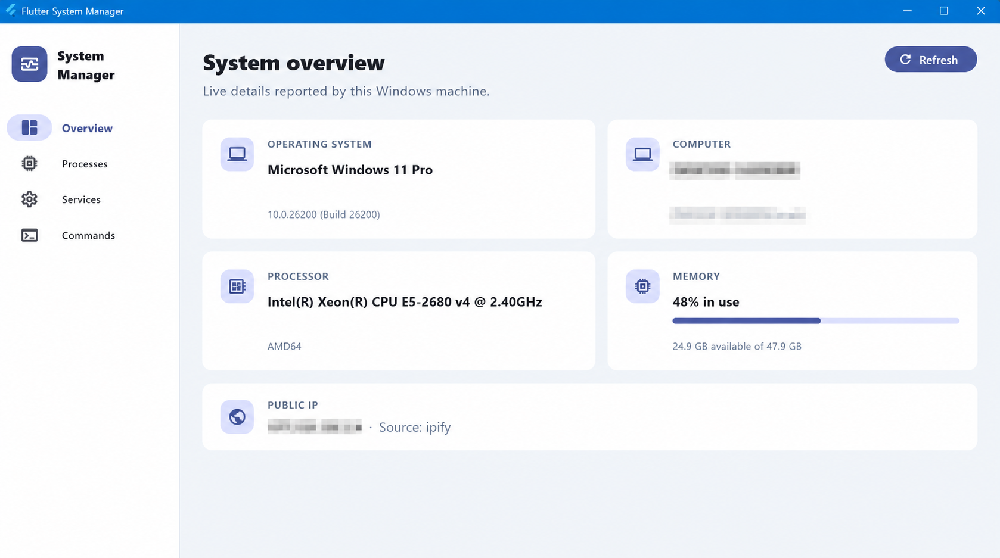
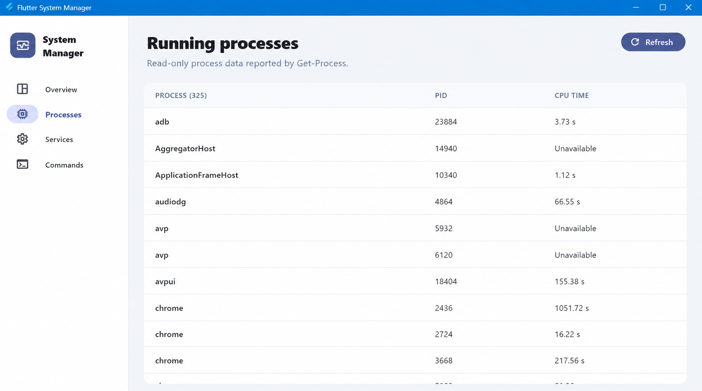
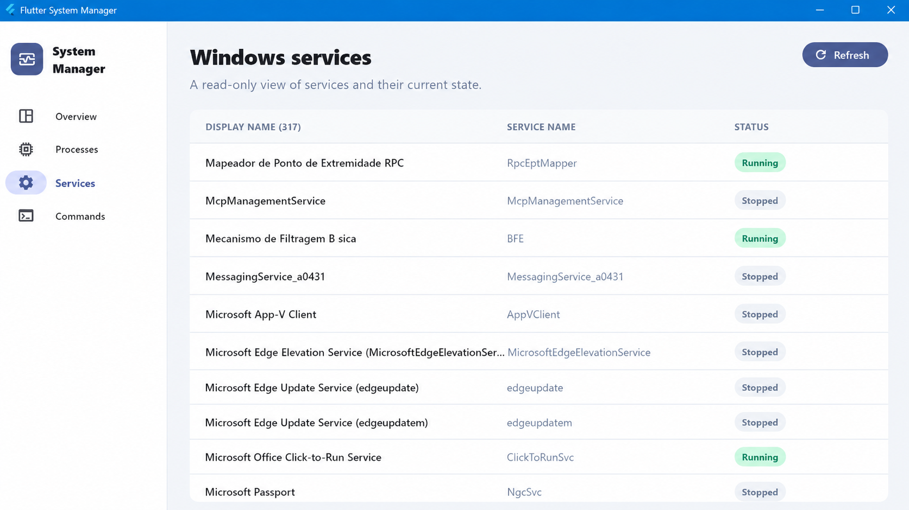
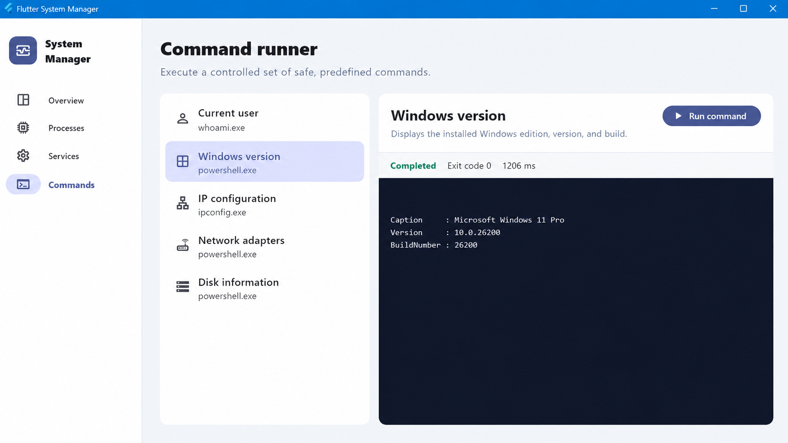

# Flutter System Manager

A Flutter Desktop technical portfolio project demonstrating Windows system integration using Dart's native process APIs.

Flutter System Manager is intentionally small: it inspects the local machine, displays structured results, and executes only a controlled set of safe commands. It is designed to give recruiters and technical reviewers a focused example of Flutter/Dart desktop engineering.

> **Platform support:** Windows is the currently supported implementation. The service boundary allows future Linux or macOS implementations, but this repository does not claim untested cross-platform system integration.

## Features

- Real operating-system, hardware, user, and memory information
- Read-only monitoring of running processes and CPU time
- Read-only inspection of Windows services and status
- Safe predefined PowerShell and Windows commands
- Command exit code, stdout, stderr, timeout, and duration handling
- Public IP lookup through a small REST integration
- Explicit loading, success, and failure states with Cubit
- Material 3 desktop interface with a responsive `NavigationRail`
- Unit, Cubit, and widget tests
- GitHub Actions continuous integration

## Screenshots

### System overview



> Privacy note: the machine name, Windows user, and public IP are intentionally blurred in the repository image. No original sensitive values are stored under `docs/screenshots/`.

### Processes and services

| Running processes | Windows services |
| --- | --- |
|  |  |

### Safe command runner



## Architecture

The UI never starts native processes or makes HTTP requests directly.

```text
Flutter UI
    ↓
Cubit
    ↓
SystemService
    ↓
dart:io Process
    ↓
PowerShell / Windows commands
```

```text
Overview UI
    ↓
PublicIpCubit
    ↓
PublicIpService
    ↓
PublicIpClient
    ↓
ipify REST API
```

`SystemService` defines the small platform contract. `WindowsSystemService` is its real Windows implementation, while `NativeProcessRunner` isolates `Process.run` behind an injectable boundary. `PublicIpService` performs the equivalent role for networking. PowerShell returns JSON for machine-readable system, process, and service queries; those responses are mapped into typed Dart models before reaching the UI.

### Clean architecture principles

- **Dependency inversion:** Cubits depend on `SystemService` and `PublicIpService`, not on PowerShell, `Process.run`, or the HTTP client.
- **Framework-independent domain models:** system information, processes, services, commands, and results are plain Dart objects.
- **Composition root:** `app.dart` selects concrete implementations and injects all dependencies in one place.
- **Testable boundaries:** native process execution, system integration, and HTTP access can be replaced with mocks or fakes.
- **Single responsibility:** widgets render state, Cubits coordinate operations, services handle external I/O, and models validate data.

These are pragmatic Clean Architecture concepts rather than a ceremonial collection of layers. The repository stays intentionally compact for its portfolio-sized scope.

## Project structure

```text
.github/
└── workflows/
    ├── ci.yml
    └── release.yml

LICENSE

lib/
├── app/
│   ├── app.dart
│   └── app_shell.dart
├── core/
│   ├── network/
│   │   └── public_ip_client.dart
│   ├── platform/
│   │   ├── native_process_runner.dart
│   │   ├── system_service.dart
│   │   └── windows_system_service.dart
│   ├── utils/
│   │   ├── error_message.dart
│   │   └── formatters.dart
│   └── widgets/
│       ├── page_header.dart
│       └── state_panels.dart
├── features/
│   ├── commands/
│   │   ├── data/predefined_commands.dart
│   │   ├── domain/{command_result,system_command}.dart
│   │   └── presentation/{cubit,pages}/
│   ├── network/presentation/cubit/
│   ├── processes/
│   │   ├── domain/system_process.dart
│   │   └── presentation/{cubit,pages}/
│   ├── services/
│   │   ├── domain/windows_service.dart
│   │   └── presentation/{cubit,pages}/
│   └── system/
│       ├── domain/system_info.dart
│       └── presentation/{cubit,pages}/
└── main.dart

docs/
└── screenshots/
    ├── command-runner.png
    ├── running-processes.png
    ├── system-overview-anonymized.png
    └── windows-services.png

test/
├── core/platform/
│   └── windows_system_service_test.dart
├── features/
│   ├── commands/
│   ├── network/
│   └── system/
└── widget_test.dart

```

The feature folders stay shallow on purpose. This project separates platform, network, state, and presentation concerns without adding repository or use-case layers that the scope does not need.

## Windows integration

The native implementation demonstrates:

- `dart:io` and `Process.run`
- PowerShell execution with `-NoProfile` and `-NonInteractive`
- `Get-CimInstance` for OS, processor, memory, and disk data
- `Get-Process` for process inspection
- `Get-Service` for service inspection
- `Get-NetAdapter`, `ipconfig.exe`, and `whoami.exe`
- Structured output with `ConvertTo-Json -Compress`
- Typed JSON parsing and validation
- Non-zero exit code, stderr, timeout, empty-output, process-start, and JSON-format errors

Native queries have a 20-second timeout. Predefined user-triggered commands have a 30-second timeout.

## Safety

This application is an inspection-focused demo.

- It does not expose a terminal or arbitrary command input.
- Every runnable command is defined by the application.
- The native service verifies the command ID, executable, and complete argument list against an allowlist before execution.
- Process termination and service start/stop controls are intentionally excluded.
- All commands run without shell interpolation (`runInShell: false`).

## REST integration

The overview retrieves the public IP address from `https://api.ipify.org?format=json`. Networking lives in `PublicIpClient`, outside the widget tree, and includes status-code, timeout, transport, and response-format handling. An internet connection is required only for this secondary card; local Windows features continue to work if the request fails.

## Download the Windows build

Download the latest portable package from [GitHub Releases](https://github.com/GuimaRodrigues/flutter_system_manager/releases/latest). Extract the complete ZIP archive and run `flutter_system_manager.exe`; Flutter does not need to be installed on the target computer.

The release also includes a `.sha256` file for integrity verification:

```powershell
Get-FileHash .\Flutter-System-Manager-Windows-x64-v1.0.0.zip -Algorithm SHA256
```

Because this portfolio build is not code-signed, Windows SmartScreen may display an unrecognized-app warning. Review the public source and checksum before running it.

## Requirements

- Windows 10 or Windows 11
- Flutter stable with Windows desktop support enabled
- Visual Studio with the **Desktop development with C++** workload
- Windows PowerShell 5.1 or compatible `powershell.exe`

Confirm the environment with:

```powershell
flutter doctor -v
flutter devices
```

## Running

```powershell
flutter pub get
flutter run -d windows
```

## Testing

```powershell
flutter test
```

The suite covers typed `SystemInfo` mapping and validation, `CommandResult` behavior, Cubit loading-to-success and loading-to-failure transitions, network and system abstractions, native JSON mapping, command allowlist enforcement, predefined command execution through a mocked `SystemService`, and the unsupported-platform widget experience.

## Static analysis

```powershell
flutter analyze
```

## CI

The GitHub Actions workflow runs on every push and pull request. A Windows runner checks out the repository, installs stable Flutter, resolves packages, runs static analysis, and executes the test suite.

## Scope and extension points

This is not a full system-administration product. A future platform implementation can implement `SystemService` and be selected at app composition time. Destructive controls, persistence, authentication, cloud infrastructure, and unrestricted command execution are deliberately outside the project scope.

## License

Released under the [MIT License](LICENSE). Copyright © 2026 Guilherme Martins.
